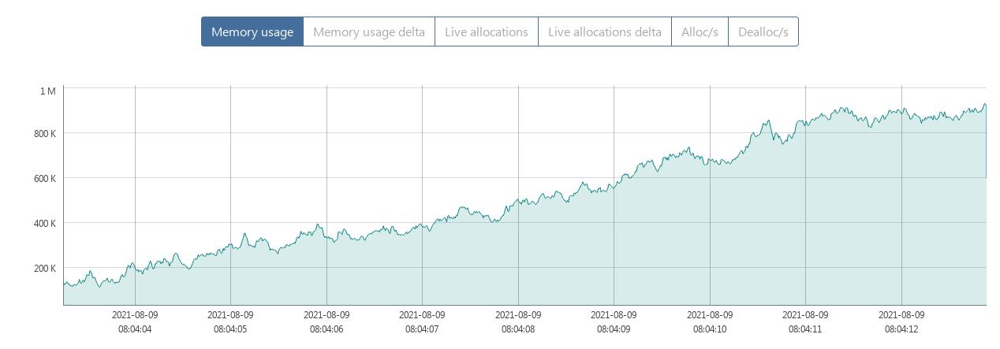
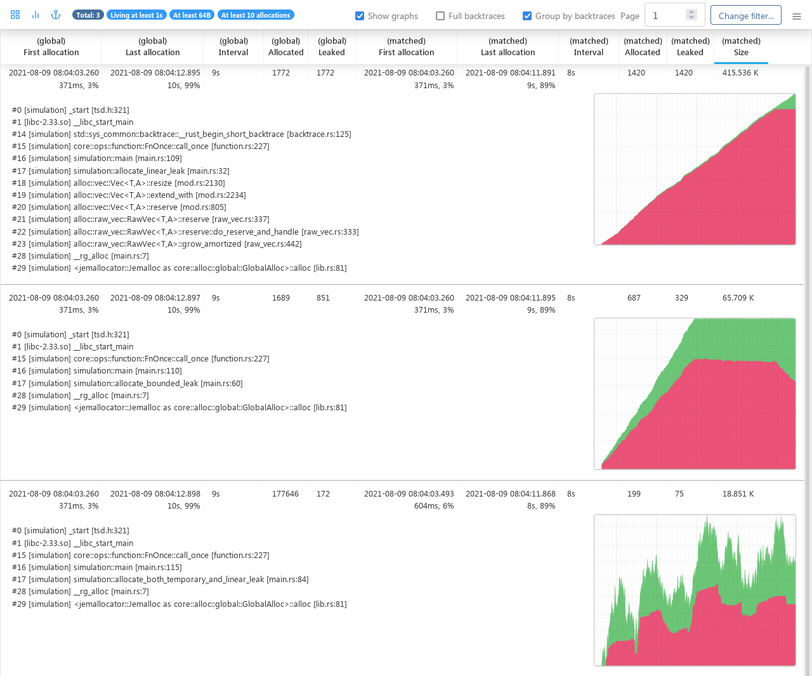
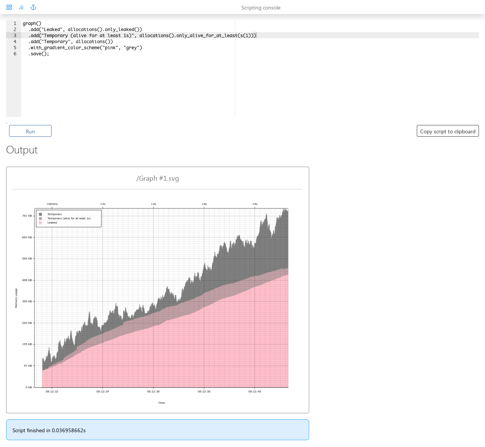
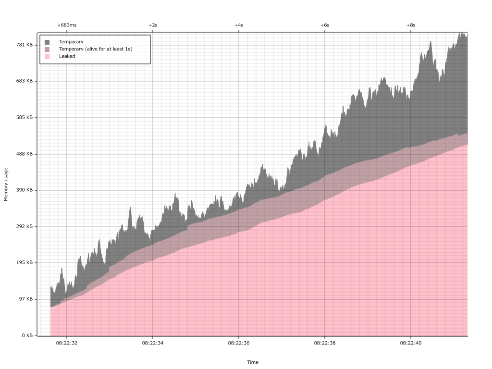

# A memory profiler for Linux

## Features

   * Can be used to analyze memory leaks, see where exactly the memory is being
     consumed, identify temporary allocations and investigate excessive memory fragmentation
   * Gathers every allocation and deallocation, along with full stack traces
   * Can dynamically cull temporary allocations allowing you to profile over a long
     period of time
   * Uses a custom, tailor-made stack unwinding implementation which makes it
     a lot cheaper than other similar tools, potentially up to orders of magnitude
     faster in some cases
   * Can export the data it gathered into various different formats; it can
     export the data as JSON (so you can analyze it yourself if you want), as
     Heaptrack (so you can use the excellent [Heaptrack GUI] for analysis)
     and as a flamegraph
   * Has its own Web-based GUI which can be used for analysis
   * Can dynamically stream the profiling data to another machine instead
     of saving it locally, which is useful for profiling on memory-constrained systems
   * Supports AMD64, ARM, AArch64 and MIPS64 architectures (where MIPS64 requires a tiny out-of-tree kernel patch for `perf_event_open`)

[Heaptrack GUI]: https://github.com/KDE/heaptrack

## Screenshots

    

    

    

    

## Building

1. Install GCC, Rust nightly and the Yarn package manager (for building the GUI)
2. Build it:

        $ cargo build --release -p memory-profiler
        $ cargo build --release -p memory-profiler-cli

3. Grab the binaries from `target/release/libmemory_profiler.so` and `target/release/memory-profiler-cli`

## Usage

### Basic usage

    $ export MEMORY_PROFILER_LOG=warn
    $ LD_PRELOAD=./libmemory_profiler.so ./your_application
    $ ./memory-profiler-cli server memory-profiling_*.dat

Then open your Web browser and point it at `http://localhost:8080` to access the GUI.

## Enabling full debug logs

By default the profiler is compiled with most of its debug logs disabled for performance reasons.
To reenable them be sure to recompile it with the `debug-logs` feature, e.g. like this:

    $ cd preload
    $ cargo build --release --features debug-logs

## License

Licensed under either of

  * Apache License, Version 2.0, ([LICENSE-APACHE](LICENSE-APACHE) or http://www.apache.org/licenses/LICENSE-2.0)
  * MIT license ([LICENSE-MIT](LICENSE-MIT) or http://opensource.org/licenses/MIT)

at your option.

### Contribution

Unless you explicitly state otherwise, any contribution intentionally submitted
for inclusion in the work by you, as defined in the Apache-2.0 license, shall be
dual licensed as above, without any additional terms or conditions.
